# Bumblebee

A local music player for Android car head units that also works well on phones. It plays the songs on the device and on any USB drive you plug in, organised by your folders. Swipe anywhere to change songs.

It was built for a budget 1280×720 head unit (Unisoc SC7731E, quad Cortex‑A7, Mali‑T820), so it is light. The APK is under 2 MB, it cold-starts in about half a second, and it uses about 50 MB of RAM. Every animation is transform/alpha only.

<p>
  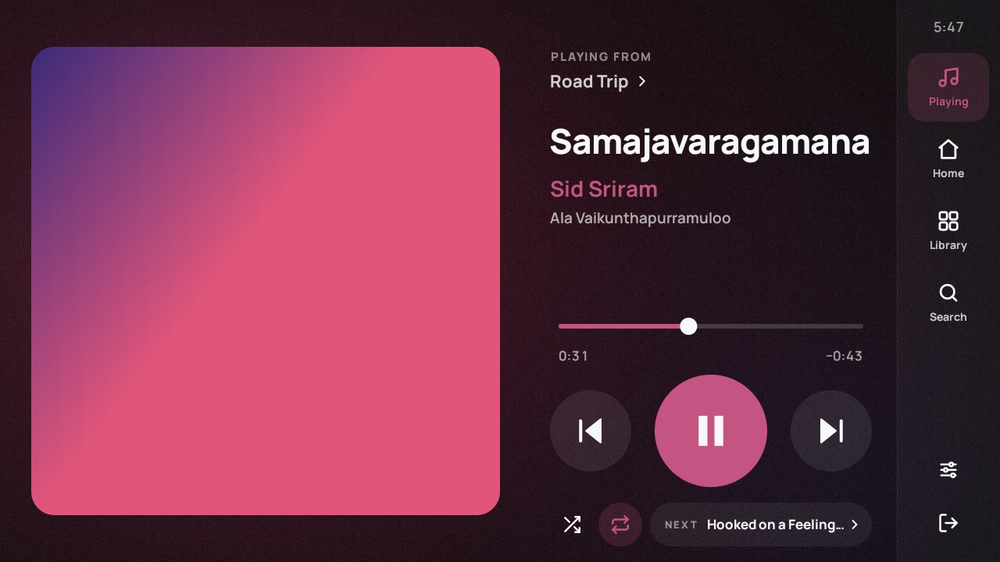
  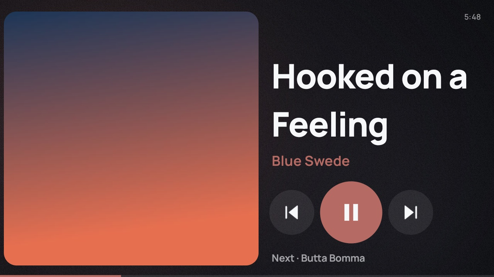
</p>
<p>
  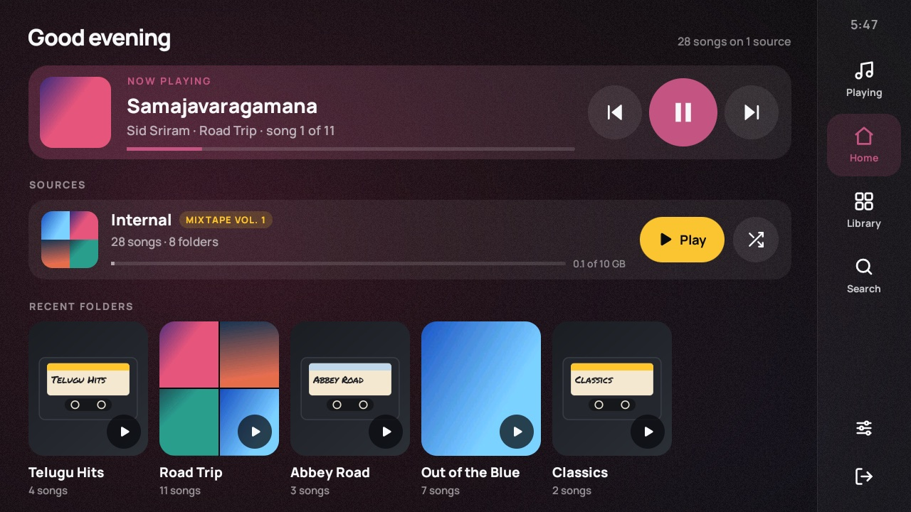
  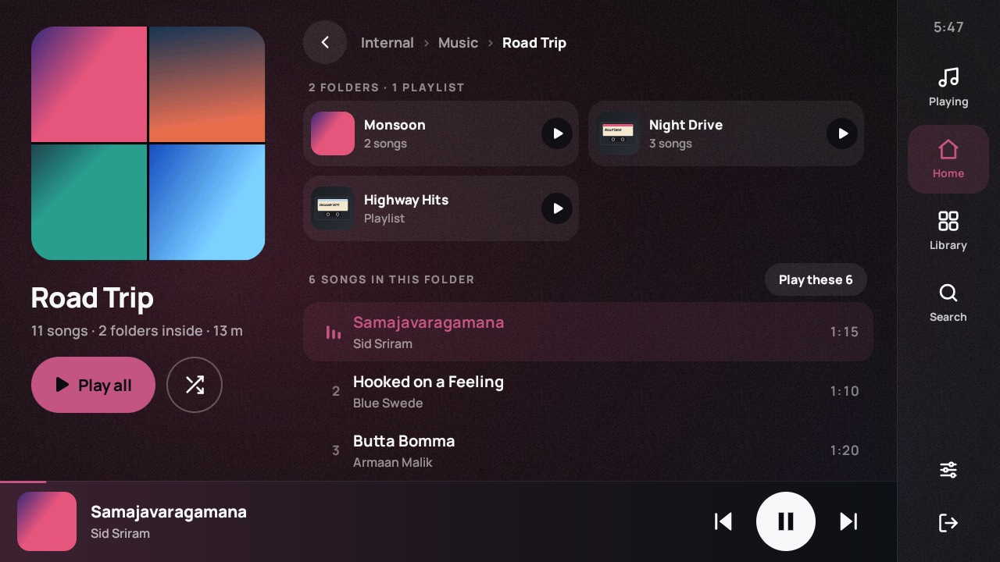
</p>
<p>
  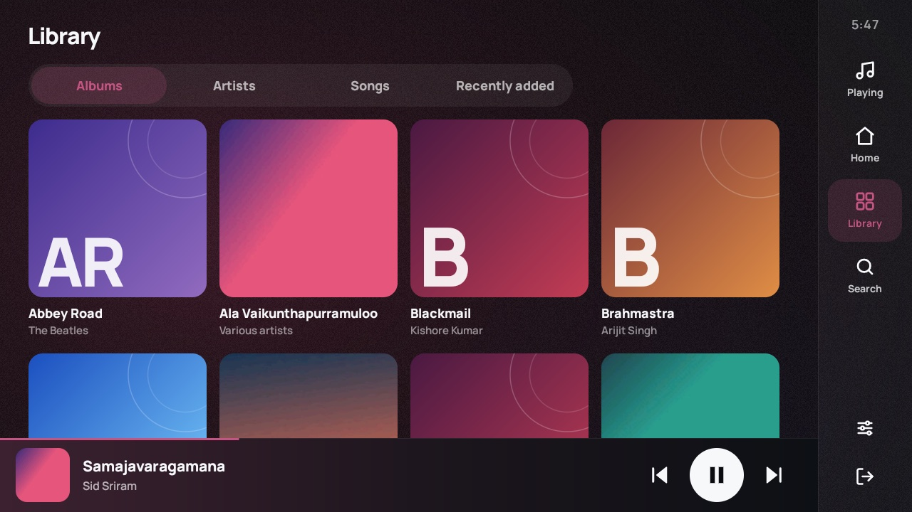
  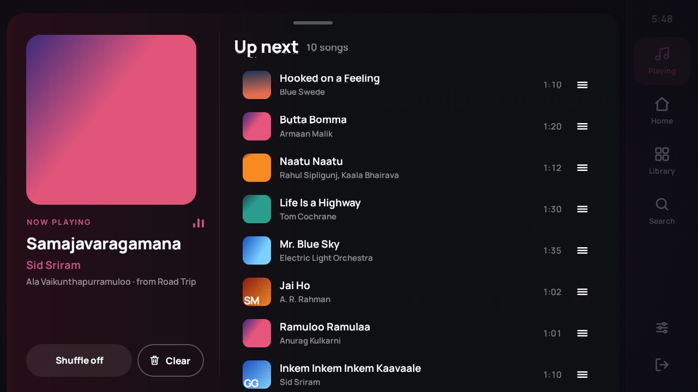
</p>
<p>
  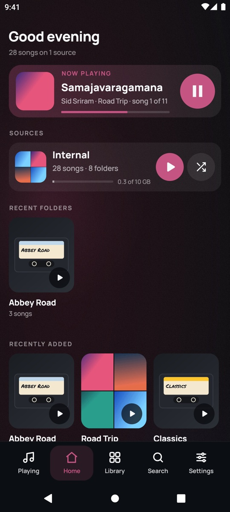
  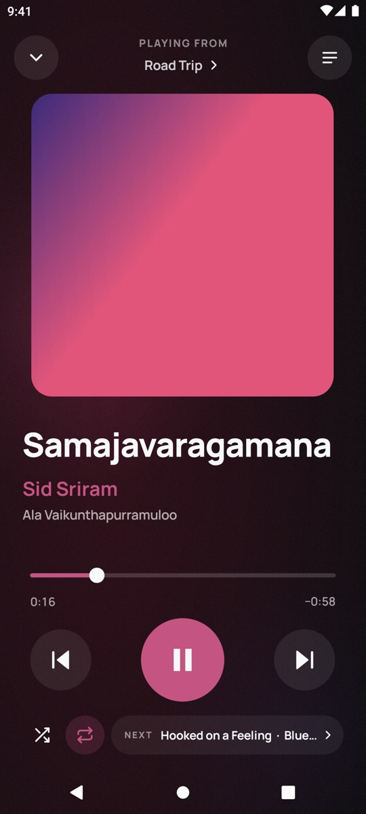
  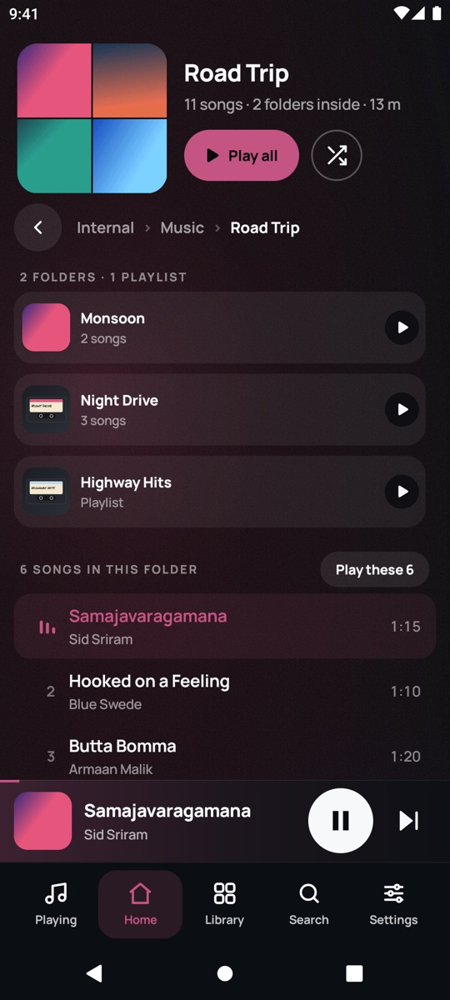
  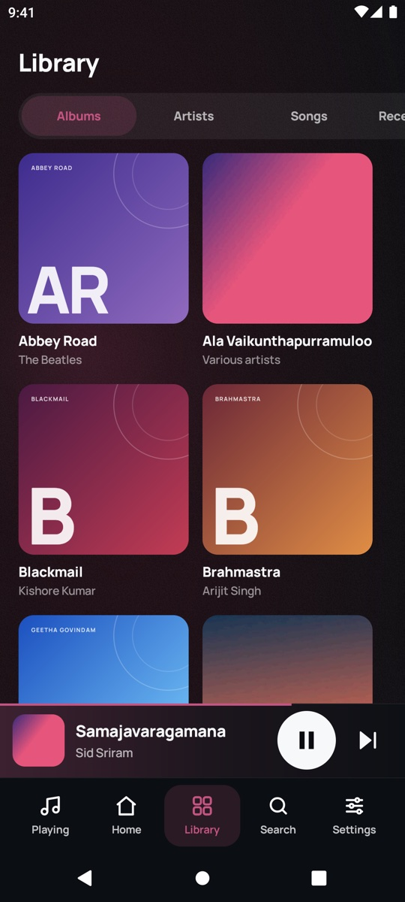
  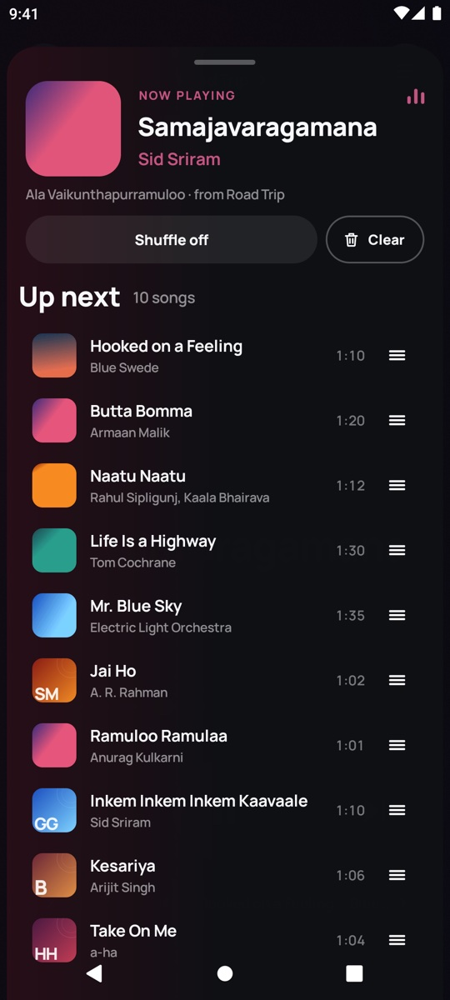
</p>

## Features

- **Folders and pendrives**
  - **Folder-first browsing.** Folders that hold both songs and subfolders show both, clearly labelled.
    - "Play all" includes everything inside.
    - Chains like `Music/Songs/All` open straight into the music.
    - Empty and system folders are hidden.
  - **USB drives.**
    - A card slides in when a drive is plugged in.
    - Pull the drive out mid-song and the player waits. When the drive is back, it offers to resume where you left off.
- **Playback controls**
  - **Swipe anywhere on Now Playing** to skip or go back. The cover moves like a card deck, and the colours follow the incoming song.
  - **Glance mode** (car): after a few idle seconds the screen reduces to a large cover, title and three big buttons. The buttons stay exactly where they were.
- **Library, search and queue**
  - Album, artist and song library from tags.
  - Instant full-text search.
  - Play next / add to queue.
  - A drag-to-reorder queue.
  - `.m3u` playlists.
- **Adapts to the screen**
  - 16:9, ultrawide (adds an "Up next" panel), 4:3, portrait head units and split-screen.
  - Phones get a bottom bar and a full-screen player you pull down to close.
- **Car friendly**
  - Right- or left-hand-drive layout.
  - Steering-wheel keys, including the old `com.android.music` broadcasts many Chinese units send.
  - Resume on boot.
- Album-tinted backgrounds, cassette-style covers for folders without art, and a few subtle easter eggs.

## Install

Download the APK from [Releases](https://github.com/MS-Teja/Bumblebee/releases/latest), or build it yourself (below). Then install it:

- **Phone:** `adb install app-release.apk`, or open the file on the phone.
- **Head unit:** most units are USB *hosts*, so a cable to a computer won't work. Either:
  - copy the APK to a pendrive and open it with the unit's file manager, or
  - enable *ADB over Wi‑Fi* in developer options and run `adb connect <unit-ip>:5555`.

On first launch, Bumblebee asks for the standard "music and audio" permission, which is enough to play everything.

On Android 11 and later, *Settings → Full file access* is optional. It adds `folder.jpg` covers and `.m3u` playlists on Android 13 and later, and covers more USB edge cases. If a head unit hides that settings screen, grant it with:

```sh
adb shell appops set com.teja.bumblebee MANAGE_EXTERNAL_STORAGE allow
```

*Settings → Under the hood* shows what the unit really is behind its Settings screen. Many budget units report an inflated Android version and RAM. The same screen has a live key log for finding out how its steering-wheel buttons arrive.

## Build

Requirements: JDK 17 and the Android SDK (compile SDK 37).

```sh
./gradlew assembleRelease     # app/build/outputs/apk/release/app-release.apk
./gradlew testDebugUnitTest   # title cleaning, natural sort, folder naming
```

The release build is signed with the debug key so it installs without extra setup. Use your own signing config before publishing it anywhere.

## How it's put together

- **Views, no fragments, no Compose.**
  - Each screen is a plain view tree with show/hide hooks.
  - `MainActivity` owns navigation and every transition:
    - fade-through between tabs;
    - shared-axis slides for pages;
    - a cover flight between the mini-player and the player.
  - Pages load their data before they open, so each arrives complete and the transition is the only motion.
- **Design units (`ui/design/Tokens.kt`).**
  - On head units, the UI is laid out on a 1280×720 canvas (720×1280 in portrait) scaled to the window, so it looks the same whatever density the unit reports.
  - On phones, one unit is pinned to about 0.78 dp, and layouts read the canvas width to adapt.
- **Playback:** Media3 ExoPlayer in a `MediaSessionService`. The queue and position are saved often enough to survive the power cut when the ignition goes off.
- **Library:** plain SQLite with an FTS4 index. A background indexer walks the drives, then fills in tags from MediaStore and the files themselves.
- **Art:** a small loader with memory and disk caches. Palette provides the accent colours. The full-screen backdrop is pre-rendered at low resolution and crossfaded, because real-time blur is too slow for the target GPU.

## Credits

- [Manrope](https://github.com/sharanda/manrope) by Mikhail Sharanda, under the SIL Open Font License 1.1.
- [Permanent Marker](https://fonts.google.com/specimen/Permanent+Marker) by Font Diner, under the Apache License 2.0.
- Built on [AndroidX Media3](https://developer.android.com/media/media3).


## License

[MIT](LICENSE) © MS-Teja
